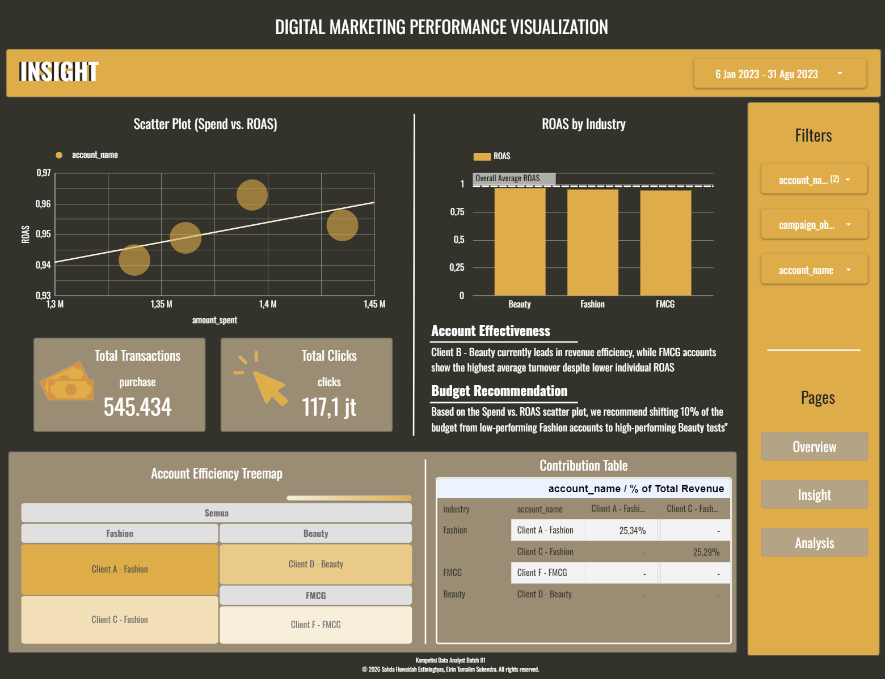
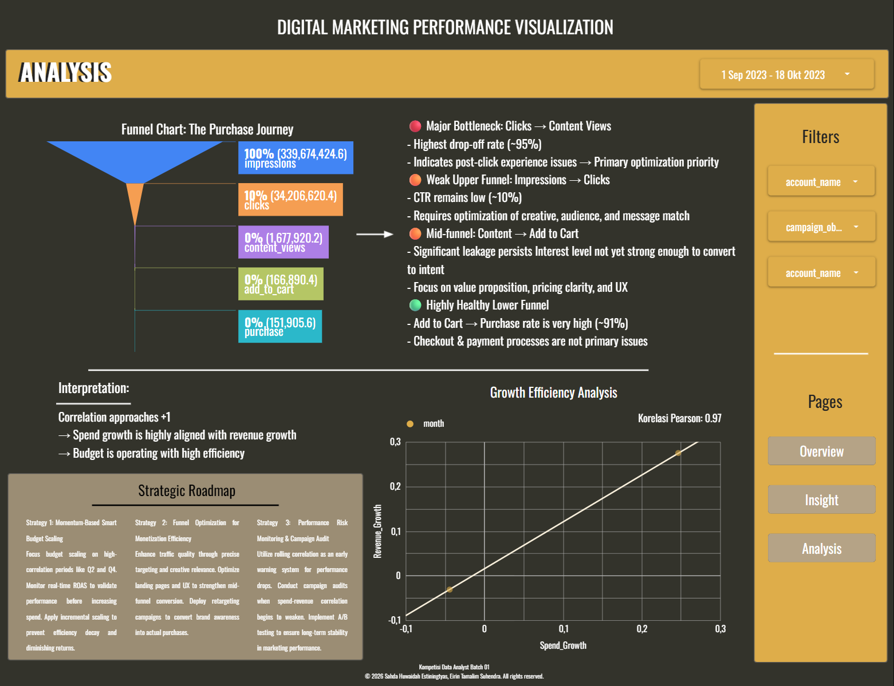

# 📊 Digital Marketing Optimization

An interactive Looker Studio dashboard for analyzing digital marketing campaign performance. This project explores campaign effectiveness, key metrics, and budget optimization strategies.

🔗 Live dashboard: https://bit.ly/dashboard_dataanalyst01

---

## 📌 Project Overview

This project aims to evaluate digital advertising campaigns for multiple clients across industries. Using historical campaign data, it provides insights on performance trends, ROAS, and revenue growth, helping agencies make informed decisions about budget allocation and funnel optimization.

The analysis was performed in Google Colab using Python, while the final interactive dashboard is built in Looker Studio for easy visualization and exploration.

---

## 🚀 Features

✅ Overview page with key metrics and KPIs  
✅ Analysis page with breakdown by campaign objective, industry, and client account  
✅ Insight page highlighting trends, anomalies, and actionable recommendations  
✅ Aggregated metrics, ROAS, and growth correlations for budget optimization  
✅ Exportable datasets for further analysis  

---

## 🛠 Tools & Resources

**Datasets:**  
- `Data Ads.csv` – Raw daily campaign data  
- `dashboard_ads_dataset.csv` – Preprocessed dataset for dashboard use  
- `monthly_dashboard_dataset.csv` – Aggregated monthly metrics including ROAS and growth correlations  

**Notebook:**  
- Google Colab notebook for data cleaning, aggregation, and metric calculation  

**Dashboard:**  
- Looker Studio interactive dashboard with three pages: Overview, Analysis, and Insight  

**Libraries Used (Python):**  
- pandas, numpy, matplotlib, seaborn  

---

## ⚙️ Usage

1️⃣ Open the Google Colab notebook to explore and preprocess data. 

2️⃣ Datasets are ready for use in the dashboard:  
- `dashboard_ads_dataset.csv`  
- `monthly_dashboard_dataset.csv`  

3️⃣ Access the Looker Studio dashboard to interact with visualizations:  

---

## 🖼 Screenshots

  

  

  

---

## 👥 Contributors

- Eirin Tamalim Suhendra

© 2026 Sahda Huwaidah Estiningtyas, Eirin Tamalim Suhendra. All rights reserved.
